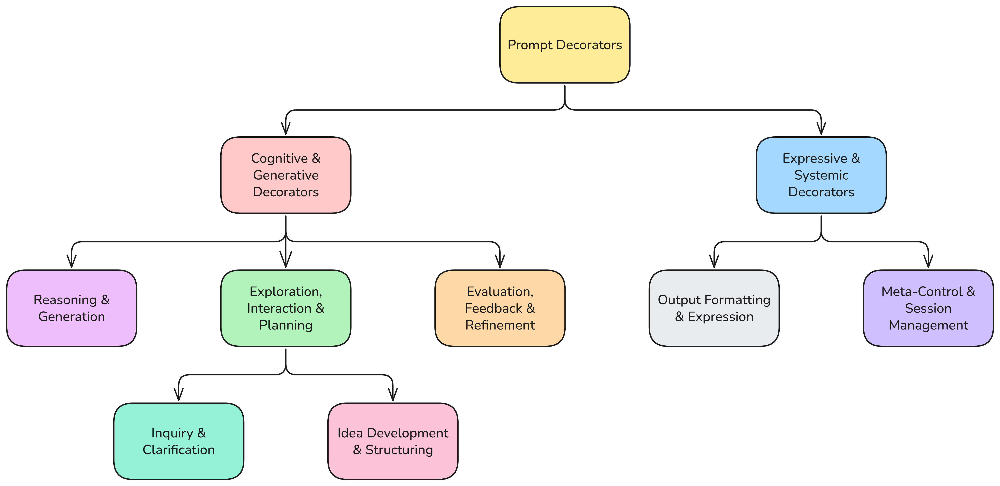

# Prompt Decorators Framework

Prompt Decorators extend the functionality of large language models by allowing structured, modular control over reasoning, style, and behavior.
Each decorator enforces specific response rules, enabling users to declaratively modify how the model thinks and writes — without retraining.

---

## Conceptual Overview

Prompt Decorators are lightweight control markers (for example, `+++Reasoning`) that alter the response generation process.
They can be combined, scoped, and remembered during conversation, forming a flexible behavioral layer over standard prompting.

---

## Categories of Prompt Decorators

The Prompt Decorators framework is organized into two main families, as illustrated in the taxonomy diagram below:



### **A. Cognitive & Generative Decorators**
These decorators guide *how the model thinks, explores, and develops ideas.*

| **Subcategory** | **Purpose** | **Key Decorators** |
|-----------------|--------------|--------------------|
| **Reasoning & Generation** | Enforce analytical, logical, or multi-perspective reasoning. | `+++Reasoning`, `+++Debate`, `+++Socratic` |
| **Exploration, Interaction & Planning** | Encourage open-ended exploration, inquiry, and planning. | `+++Interactive`, `+++Brainstorm`, `+++Planning`, `+++Import` |
| **Inquiry & Clarification** | Ensure information gaps are identified and clarified before proceeding. | `+++Interactive`, `+++Rewrite` |
| **Idea Development & Structuring** | Refine, structure, and extend ideas into coherent outputs. | `+++Rewrite`, `+++Planning` |
| **Evaluation, Feedback & Refinement** | Critically assess and improve content through iteration. | `+++Critique`, `+++Refine`, `+++Candor` |

---

### **B. Expressive & Systemic Decorators**
These decorators control *how the model expresses results, manages sessions, and ensures consistency.*

| **Subcategory** | **Purpose** | **Key Decorators** |
|-----------------|--------------|--------------------|
| **Output Formatting & Expression** | Structure or constrain the format and tone of output. | `+++OutputFormat`, `+++Tone` |
| **Meta-Control & Session Management** | Manage decorator state, memory, and operational flow. | `+++ChatScope`, `+++MessageScope`, `+++Clear`, `+++ActiveDecs`, `+++AvailableDecs`, `+++Validate`, `+++FactCheck`, `+++CiteSources`, `+++Export`, `+++Dump` |

---

## Combining Decorators

Multiple decorators can be combined to refine responses.
For example:

```prompt
+++Reasoning
+++StepByStep
+++Tone(style=formal)

Explain the economic impact of renewable energy transitions.
```

This prompt enforces logical reasoning, structured progression, and formal tone simultaneously.

---

## Key Prompt Decorators and Their Benefits

| **Prompt Decorator** | **Parameters** | **Function** |
|----------------------|---------------|--------------|
| `+++Reasoning` | — | Ensures logical explanation before answering |
| `+++StepByStep` | — | Breaks down complex tasks into sequential reasoning |
| `+++Socratic` | — | Encourages critical thinking through guided questions |
| `+++Debate` | — | Generates multiple perspectives before concluding |
| `+++Critique` | — | Analyzes strengths and weaknesses before improving |
| `+++Refine(iterations=N)` | `iterations` – number of refinement cycles | Iterates through multiple improvements |
| `+++Interactive(limit=N, style=TYPE)` | `limit`, `style` | Asks clarifying questions when context is incomplete |
| `+++Planning` | — | Outlines objectives and approach before execution |
| `+++Brainstorm(limit=N, diversity=LEVEL)` | `limit`, `diversity` | Produces diverse ideas without early evaluation |
| `+++Rewrite` | — | Reframes the user’s prompt for clarity and precision |
| `+++Import(topic=STRING)` | `topic` – conceptual or disciplinary lens | Applies a named lens to reasoning |
| `+++Candor(level=LEVEL)` | `level` – low, medium, or high | Controls feedback directness while staying professional |
| `+++OutputFormat(format=FORMAT)` | `format` – output type | Structures the response in a specific format |
| `+++Tone(style=STYLE)` | `style` – tone or register | Adjusts the communication tone or style |
| `+++FactCheck` | — | Verifies factual accuracy of key claims |
| `+++CiteSources` | — | Ensures all major claims are supported by sources |
| `+++Validate` | — | Performs self-check on grammar, logic, and consistency |
| `+++ChatScope` | — | Applies decorators persistently across a conversation |
| `+++MessageScope` | — | Limits decorator effects to a single message |
| `+++Clear(targets=LIST)` | `targets` – decorators to clear (optional) | Clears all or specified active decorators |
| `+++ActiveDecs` | — | Lists currently active decorators |
| `+++AvailableDecs` | — | Lists all available decorators and their status |
| `+++Export(format=FORMAT)` | `format` – text, markdown, json, yaml | Exports or summarizes conversation in a chosen format |
| `+++Dump` | Alias of `+++Export` | Quick or raw output version of `+++Export` |


---

## How Scope and Memory Work

Decorator scope controls *how long* and *where* a decorator applies:

- **Message Scope** (`+++MessageScope`) → Affects only the current prompt.
- **Chat Scope** (`+++ChatScope`) → Persists across conversation turns.
- **Clear** (`+++Clear`) → Resets decorators selectively or entirely.

The system retains awareness of active decorators to ensure consistent behavior between exchanges.

---

## Prompt Decorators Definitions

Detailed definitions for each decorator are provided in **[`prompt-decorators.txt`](./prompt-decorators.txt)**.

Each definition specifies:
- Behavioral rules
- Response structure
- Parameters (if applicable)
- Compliance and scope requirements

### How to Use the Definition File

Prompt Decorators rely on the model’s memory of definitions.
To enable them in chat-based LLMs (such as ChatGPT, Gemini, Claude, or Grok):

1. **Provide the definitions file once** — paste the contents of `prompt-decorators.txt` into the chat or add it to your custom/system instructions.
2. The model will then “remember” the rules and behaviors of each decorator for that session.
3. You can activate decorators inline by prefixing them in your prompt, for example:

```prompt
+++Reasoning
+++Tone(style=formal)

Explain why renewable energy transition affects global markets.
```

4. Multiple decorators can be combined to modify reasoning, tone, structure, and verification layers.
5. To reset behaviors, use `+++Clear` or restart the session.

This approach makes decorators portable and platform-agnostic — no code modification required.

---

## Examples of Decorator Usage

Below are simple examples illustrating how one, two, or three decorators change the model’s behavior.
These examples use natural language inputs that can be pasted directly into an LLM chat.

### **Example 1 – Single Decorator**

```prompt
+++Reasoning

Why did the Roman Empire fall?
```

**Expected behavior:** The model explains its reasoning process before answering, giving a logical chain of causes.

---

### **Example 2 – Two Decorators**

```prompt
+++StepByStep
+++Tone(style=formal)

Describe how neural networks learn from data.
```

**Expected behavior:** The model breaks down the explanation into sequential steps, maintaining a formal tone.

---

### **Example 3 – Three Decorators**

```prompt
+++Brainstorm(limit=5, diversity=high)
+++Critique
+++Refine(iterations=3)
Propose innovative applications for large language models in healthcare.
```

**Expected behavior:**
1. The model first generates five diverse ideas.
2. Then it critiques their strengths and weaknesses.
3. Finally, it refines and improves the top ideas over two iterations.

These compositional examples show how decorators can stack logically to form complex cognitive workflows without retraining the model.

---

## Citation

The Prompt Decorators framework is described in detail in the paper:

**"Prompt Decorators: A Declarative and Composable Syntax for Reasoning, Formatting, and Control in LLMs"**  
*Mostapha Kalami Heris*  
arXiv preprint arXiv:2510.19850 (2025)

📄 **Read the full paper:** [https://arxiv.org/abs/2510.19850](https://arxiv.org/abs/2510.19850)

### BibTeX Citation

```bibtex
@misc{heris2025promptdecorators,
      title={Prompt Decorators: A Declarative and Composable Syntax for Reasoning, Formatting, and Control in LLMs}, 
      author={Mostapha Kalami Heris},
      year={2025},
      eprint={2510.19850},
      archivePrefix={arXiv},
      primaryClass={cs.PL},
      url={https://arxiv.org/abs/2510.19850}
} 
}
```

---

## License

This framework is open-source under the MIT License.
You are free to adapt, extend, or integrate it in your own prompt engineering workflows with attribution.