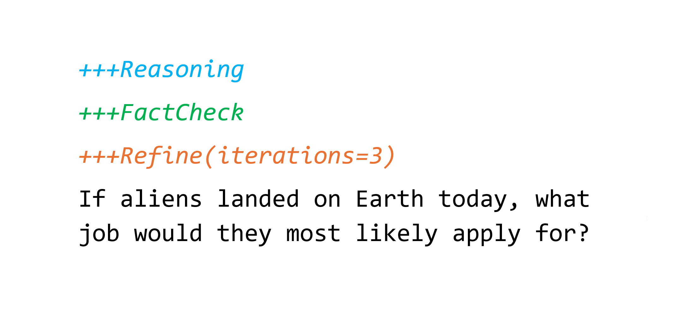

# Prompt Decorators



Artificial intelligence is an incredibly powerful tool, but the quality of its responses often depends on how effectively we communicate with it. If you have ever struggled to get a precise, well-structured answer from an AI model, you are not alone. Many users face inconsistencies, vague responses, or excessive trial-and-error in prompt formulation. What if there was a way to standardize and refine AI outputs effortlessly?

**Enter Prompt Decorators** — a simple yet powerful approach that enhances AI responses using structured prefixes. By guiding AI with standardized instructions, Prompt Decorators help ensure that answers are clear, logical, and well-organized. Whether you are a researcher, developer, marketer, or casual user, this technique will save you time and frustration while unlocking AI’s full potential.

---

## 1. Introduction: The Challenge of AI Prompting

AI models have revolutionized how we interact with technology, enabling automated content generation, research assistance, and problem-solving. However, the effectiveness of AI-generated responses depends significantly on how prompts are structured. Many users encounter common challenges when interacting with AI:

1. **Ambiguous prompts lead to unpredictable responses.**  
   AI models generate answers based on statistical patterns rather than deep understanding. A vague prompt like *"Explain machine learning"* can lead to a broad range of responses, from a beginner-friendly definition to an advanced technical discussion.

2. **Overly detailed prompts are cumbersome and inconsistent.**  
   Users often attempt to compensate for AI unpredictability by writing excessively detailed prompts, but this does not always lead to consistently structured responses.

3. **Effective prompt engineering is not intuitive.**  
   Crafting precise prompts requires experience, and minor changes in wording can significantly impact AI responses. Without a standardized method, users struggle to get the desired output efficiently.

To address these issues, **Prompt Decorators** offer a straightforward yet powerful solution.

---

## 2. Introducing Prompt Decorators (`+++`)

Inspired by Python decorators, **Prompt Decorators** allow users to modify AI behavior using simple prefixes at the start of a prompt. They offer a standardized way to structure AI responses without the need for lengthy instructions.

### Why `+++` Instead of `@`?

In Python, the `@` symbol is used to apply decorators to functions and classes. However, many online platforms and tools also use `@` for tagging users and agents, making it an impractical choice for AI prompting. To avoid conflicts and ensure clarity, `+++` is used as a distinct and intuitive prefix for Prompt Decorators.

---

## 3. Example of Prompt Decorators in Action

This is a normal prompt without decorators:

```
Suggest a name for an AI YouTube channel focused on AI/ML video tutorials.
```

Enhanced with a decorator:

```
+++Reasoning
Suggest a name for an AI YouTube channel focused on AI/ML video tutorials.
```

The `+++Reasoning` decorator forces the AI to provide a logical explanation before suggesting names, encouraging critical thinking and clarity.

Multiple decorators can be combined to refine responses even further:

```
+++Refine(iterations=3)
+++Reasoning
Suggest a name for an AI YouTube channel focused on AI/ML video tutorials.
```

This example instructs the AI to refine its response through three iterations while providing a logical explanation first.

---

## 4. Key Prompt Decorators and Their Benefits

| **Prompt Decorator**             | **Function**                                       |
| -------------------------------- | -------------------------------------------------- |
| `+++Reasoning`                   | Ensures logical explanation before answering       |
| `+++StepByStep`                  | Breaks down complex tasks into steps               |
| `+++Socratic`                    | Encourages critical thinking through questions     |
| `+++Debate`                      | Generates multiple perspectives                    |
| `+++Critique`                    | Analyzes strengths and weaknesses before improving |
| `+++Refine(iterations=N)`        | Iterates through multiple refinements              |
| `+++CiteSources`                 | Ensures AI includes references                     |
| `+++FactCheck`                   | Prioritizes verifying factual accuracy             |
| `+++OutputFormat(format=FORMAT)` | Structures the response in a specified format      |
| `+++Tone(style=STYLE)`           | Enforces a specific tone                           |
| `+++ChatScope`                   | Applies decorators across the entire conversation  |
| `+++MessageScope`                | Limits decorators to the specific message          |
| `+++Clear`                       | Clears all or selected active decorators           |
| `+++ActiveDecs`                  | Displays currently active decorators               |
| `+++AvailableDecs`               | Lists all available decorators with their statuses |

Each decorator plays a crucial role in improving AI interactions by enforcing structured, thoughtful, and reliable responses.

---

## 5. Scope Management and Active Decorators

Prompt Decorators can operate at two scopes:

- **Message Scope**: Decorators apply only to the current prompt.
- **Chat Scope**: Decorators persist across multiple prompts until cleared.

You can manage active decorators dynamically using special decorators:
- `+++ChatScope` to activate conversation-wide decorators,
- `+++MessageScope` to revert to single-message mode,
- `+++Clear` to clear all or selected active decorators,
- `+++ActiveDecs` to view active decorators,
- `+++AvailableDecs` to view all available decorators and their current status.

Maintaining active decorator memory and respecting scope are mandatory for consistent behavior.

---

## 6. Prompt Decorators Definitions

The detailed definitions of each Prompt Decorator are provided in the [`prompt-decorators.txt`](./prompt-decorators.txt) file located in this repository.

This document defines not only how each decorator must behave but also enforces strict compliance requirements, memory management, and scope handling during conversations.

Please note that this implementation reflects one possible realization of the idea. Others may find better ways to define and extend Prompt Decorators over time.

---

## 7. Learn More

To dive deeper into the concept of Prompt Decorators and how they can enhance AI interactions, check out the detailed article on Medium:  
**[Read the full article HERE.](https://kalami.medium.com/prompt-decorators-a-simple-way-to-improve-ai-responses-c3f3c2579a8c)**

---

## 8. Contribution & Licensing

Contributions to expand, refine, or optimize Prompt Decorators are welcome. If you have suggestions, feel free to submit a pull request.

This repository is distributed under the **MIT License**. See [`LICENSE`](./LICENSE) for details.
